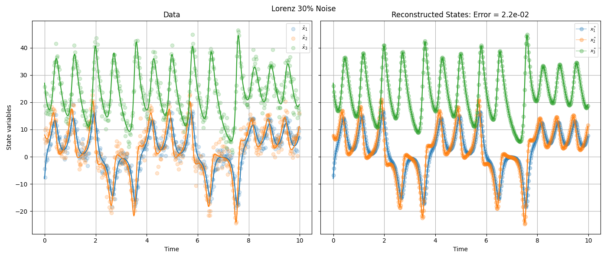

# Sparse regression method for discovery of ordinary differential equations from incomplete and noisy data

This project implements a sparse regression framework to discover ordinary differential equations (ODEs) from time series data that may be incomplete and corrupted by noise. The method simultaneously estimates the underlying system dynamics and reconstructs the latent state trajectory by minimizing a regularized loss function of the form:

$$
\mathcal{L}(u, \theta) = \\|\dot{u} - f(u; \theta)\\|^2 + \lambda \\|u - \hat{u}\\|^2 + R(\theta)
$$

Here:
- $\hat{u}$ is the observed (possibly incomplete or noisy) data,
- $f(u; \theta)$ is a user-defined candidate library,
- $\theta$ are coefficients applied to the library terms,
- $\lambda$ controls how closely the recovered states match the data,
- $R(\theta)$ is a sparsity-promoting penalty weighted by \(R\) (Here smooth $\ell_0$).

When multiple values of $\lambda$ and $R$ are provided, the algorithm evaluates each resulting model using **validation error** (via a user-defined mask), and selects the best model according to statistical information criteria **BIC**.

Optimization is performed using a second-order variant of the **Levenberg-Marquardt algorithm**, with gradients and Hessians computed via **automatic differentiation**. The method includes support for sparse Hessians to scale to higher-dimensional problems efficiently.

## Simple Example (For complete examples look at examples folder)

Lorenz equations:

$$
\begin{align*}
\dot{x} &= \sigma(y - x) \\
\dot{y} &= x(\rho - z) + y \\
\dot{z} &= xy - \beta y
\end{align*}
$$

$$(\sigma, \rho, \beta) = (10, 28, 8/3)$$

```python
# Full example code for ODE discovery found in examples/_Lorenz/Lorenz.ipynb where x_data_true comes from numerical solution

Data = np.load('../../_ODEData/LorenzData.npz')
x_data_true_full, t_full = Data['x'], Data['t']

subsample = 20
x_data_true, t = x_data_true_full[::subsample], t_full[::subsample]

noise_p, stand_dev = .3, np.std(x_data_true, axis = 0)
x_data = x_data_true + np.random.normal(0,percent_noise*noise,size = x_data_true.shape)

Library = PolyFunc(num_vars=x_data.shape[1],degree=2)
discoverLorenz = ode(x_data,Library,[TSpan[0],TSpan[1]])

lambdas, Rs = [10**(-2)],[10**(-4)]
discoverode.FindBestModel(lambdas, Rs)

models = discoverode.PrintModels(N_best= 1) #Increase cutoff to see other models found
opt_params, opt_NL_params, opt_states = discoverode.best_model()

```

Found Equations:

$$
\begin{align*}
\dot{x_1} &= -9.97x_{1} + 10.03x_{2} \\
\dot{x_2} &= 27.36x_{1} - 0.95x_{2} - 0.98x_{1} x_{3} \\
\dot{x_3} &= -2.76x_{3} + 0.96x_{1} x_{2} 
\end{align*}
$$



## Software Requirements

This project requires the following software and libraries to be installed:

- **[JAX](https://github.com/google/jax)** — computations and automatic differentiation  
- **[scikit-sparse](https://github.com/scikit-sparse/scikit-sparse)** — sparse Cholesky factorization  
- **[matplotlib](https://matplotlib.org/)** — plotting and visualization

### For full reproducibility

Install **Python 3.11.11** and follow the steps below to set up a clean environment.

### Setup Instructions

Clone the repository and navigate to it, then:

```bash

python3.11 -m venv sparse_discovery_env
source sparse_discovery_env/bin/activate

pip install -r requirements.txt
